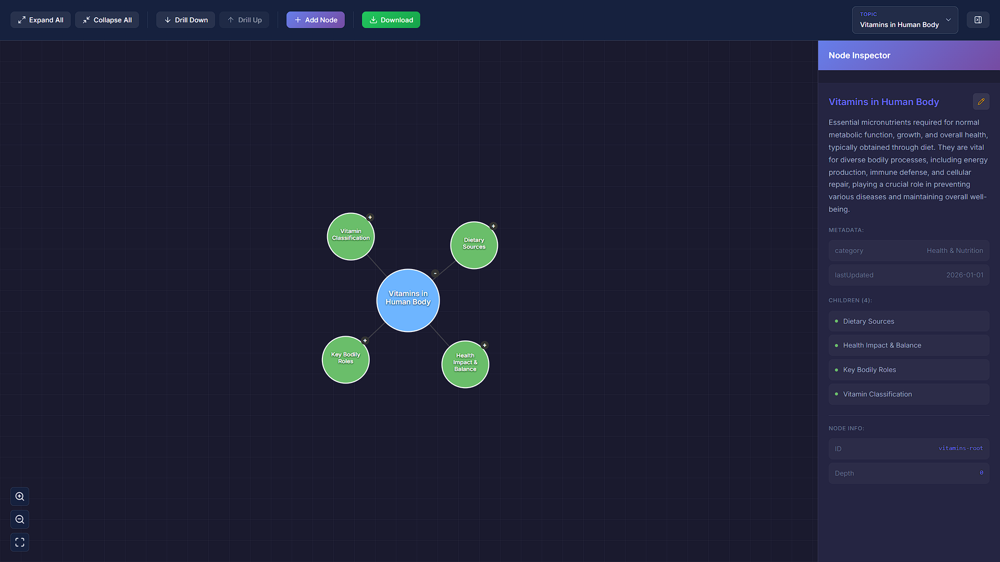
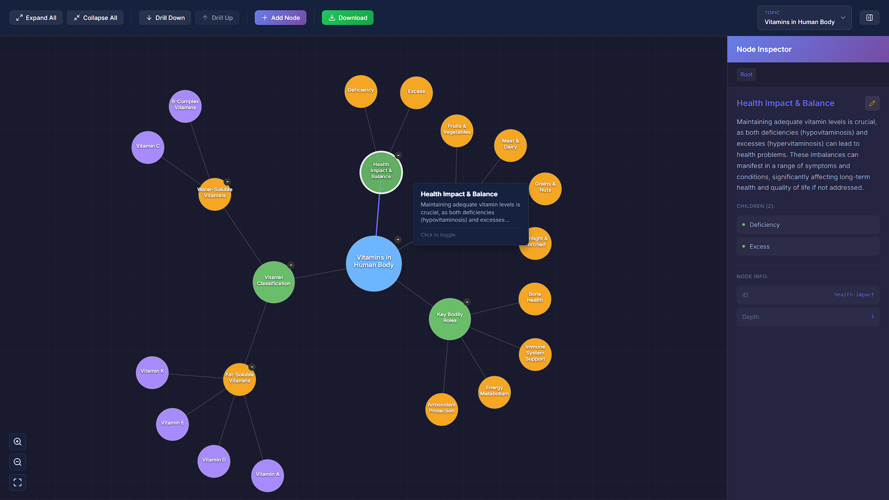
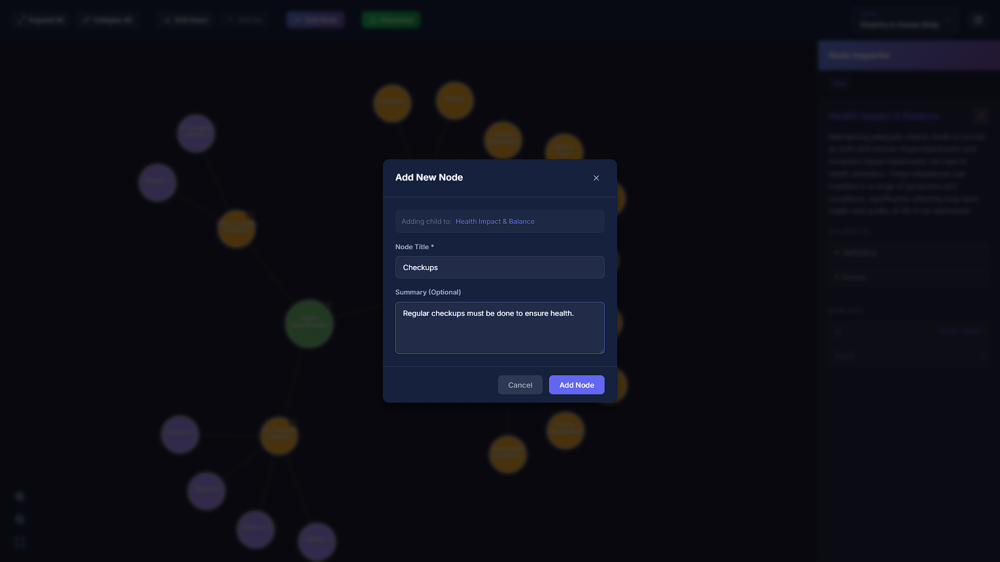
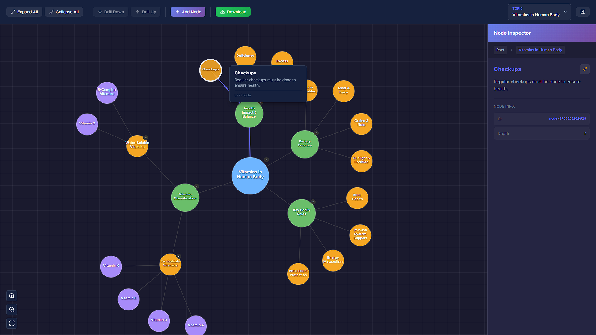
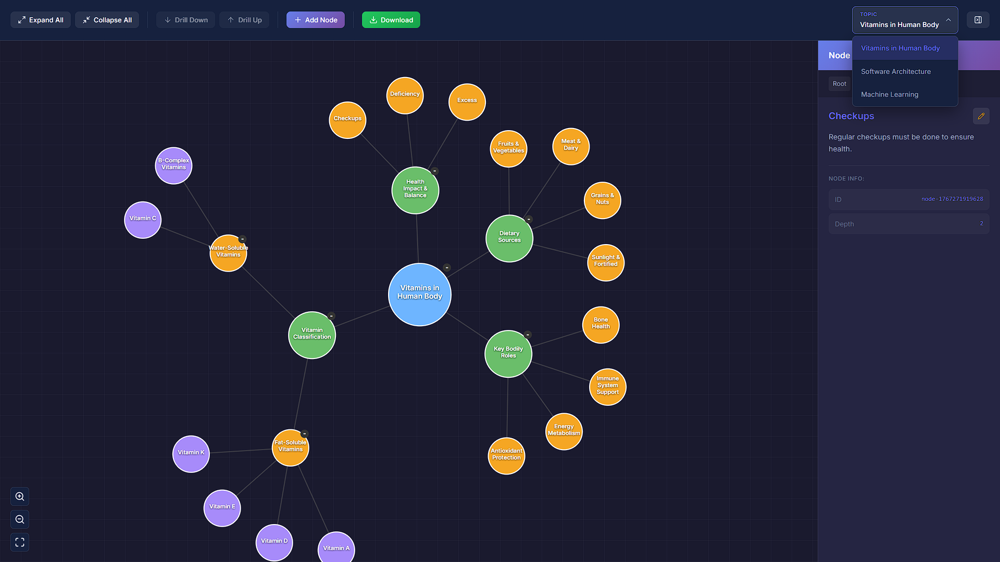
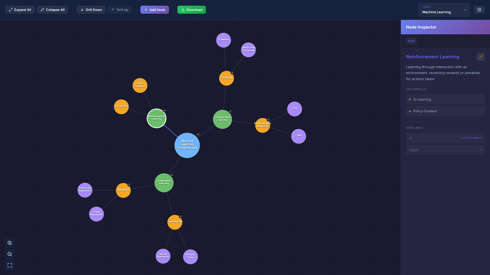

# Interactive Mindmap UI

A fully interactive, **data-driven mindmap visualization** application built with React and D3.js. This project demonstrates hierarchical data visualization with rich user interactions including hover effects, click-to-expand, node editing, and topic switching.

## 🚀 Quick Start

```bash
npm install
npm run dev
```

Then open http://localhost:5173 in your browser.

---

## 📋 Features

### ✅ Core Requirements

| Feature                   | Status | Description                                                       |
| ------------------------- | ------ | ----------------------------------------------------------------- |
| **Mindmap Visualization** | ✅     | Hierarchical graph with nodes and connections                     |
| **Data-Driven Rendering** | ✅     | Fully generated from JSON - change data, UI updates automatically |
| **Hover Interactions**    | ✅     | Tooltips showing title, summary, and action hints                 |
| **Click Interactions**    | ✅     | Select nodes, expand/collapse children                            |
| **Side Panel**            | ✅     | Detailed view with summary, metadata, and children list           |
| **Node Editing**          | ✅     | Inline edit for title and summary                                 |
| **Expand/Collapse All**   | ✅     | Toolbar buttons to show/hide entire tree                          |
| **Drill Down/Up**         | ✅     | Focus on subtrees with navigation                                 |
| **Fit to View**           | ✅     | Auto-center and scale the mindmap                                 |
| **Add Node**              | ✅     | Modal to add new child nodes                                      |
| **Multiple Topics**       | ✅     | Switch between different mindmap datasets                         |

### 🎁 Bonus Features

| Feature               | Status                  |
| --------------------- | ----------------------- |
| **Download/Export**   | ✅ Export as JSON       |
| **Smooth Animations** | ✅ D3 force simulation  |
| **Zoom Controls**     | ✅ Zoom in/out + scroll |
| **Pan & Zoom**        | ✅ Drag to pan          |

---

## 🛠️ Technologies Used

| Technology       | Version | Purpose                           |
| ---------------- | ------- | --------------------------------- |
| **React**        | 18.2    | UI Component Framework            |
| **Vite**         | 5.0     | Build Tool & Dev Server           |
| **D3.js**        | 7.8     | Data Visualization & Force Layout |
| **Lucide React** | 0.294   | Icon Library                      |
| **Vanilla CSS**  | -       | Custom Styling                    |

### Why These Technologies?

1. **React**: Component-based architecture enables clean separation of concerns
2. **D3.js**: Industry-standard for data visualization with force simulation, zoom/pan, and SVG rendering
3. **Vite**: Fast development with hot module replacement
4. **No Backend**: Pure frontend solution demonstrating data-driven approach

---

## 📁 Project Architecture

```
ui-assignment-2/
├── public/
│   └── mindmap-data.json       ← 🔥 DATA SOURCE (edit to update UI)
├── src/
│   ├── context/
│   │   └── MindmapContext.jsx  ← State management
│   ├── components/
│   │   ├── Toolbar/            ← Top control bar
│   │   ├── Sidebar/            ← Right panel with node details
│   │   ├── MindmapCanvas/      ← D3 visualization
│   │   └── AddNodeModal/       ← Node creation modal
│   ├── utils/
│   │   └── treeUtils.js        ← Tree manipulation helpers
│   ├── App.jsx                 ← Main layout
│   └── main.jsx                ← Entry point
└── screenshots/                ← Submission screenshots
```

---

## 🔄 Data Flow

```
mindmap-data.json
        │
        ▼
  MindmapContext.jsx (fetches, parses, manages state)
        │
        ├──────────────────┬──────────────────┐
        ▼                  ▼                  ▼
    Toolbar          MindmapCanvas        Sidebar
  (controls)         (D3 visualization)   (details/edit)
```

### Key Design Decisions

1. **Flat Node Array**: Tree is flattened for O(1) lookups
2. **Context API**: Central state management without external libraries
3. **D3 Force Simulation**: Organic node positioning with collision detection
4. **Separated Effects**: Selection updates don't trigger full re-render

---

## 📊 Data Schema

Edit `public/mindmap-data.json`:

```json
{
  "topic-key": {
    "id": "unique-id",
    "title": "Node Title",
    "summary": "Detailed description...",
    "metadata": { "category": "Optional" },
    "children": [{ "id": "child-1", "title": "Child Node", "summary": "..." }]
  }
}
```

### Updating the Mindmap

- **Add a node**: Add object to `children` array
- **Edit text**: Change `title` or `summary`
- **Add a topic**: Add new key to root object
- **Restructure**: Move nodes between parents

UI updates automatically after refresh.

---

## 📸 Screenshots

### Full Mindmap View



### Expanded View



### Add Node Modal



### Added Node in Mindmap



### Topic Selection Dropdown



### Machine Learning



---

## 🎥 Demo Video

[Link to demo video - to be added]

---

## 🏃 How to Run

### Prerequisites

- Node.js 16+

### Commands

```bash
npm install       # Install dependencies
npm run dev       # Start dev server
npm run build     # Production build
npm run preview   # Preview production build
```

---

## 🧪 Testing Data-Driven Approach

1. Open `public/mindmap-data.json`
2. Make changes (update title, add node, add topic)
3. Refresh browser
4. UI reflects changes without code modifications

---

## 📝 Assumptions & Decisions

1. **Force Layout**: Chose force simulation for organic positioning
2. **Color by Depth**: Node colors indicate hierarchy level
3. **Single Selection**: One node selected at a time
4. **Memory-only Persistence**: Edits stored in memory (production would use backend)
5. **Three Sample Topics**: Vitamins, Software Architecture, Machine Learning

---
